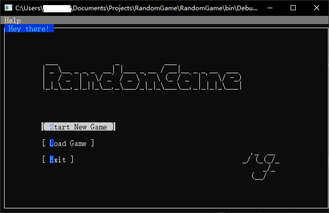

# RandomGame

A Random Game

This program is in intensively develop and testing. It's completely non-stable.

You can get the executable in this project's Actions workflow as the link in "upload artifact" section of the job "build". You have to install [.NET Runtime 8.0](https://dotnet.microsoft.com/zh-cn/download/dotnet/8.0) to run this program.

You can easily build this program using dotnet 6.0 or newer.

This project currently using GPLv3, but it may changes in the future.

